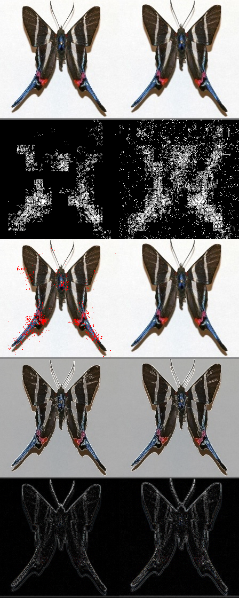
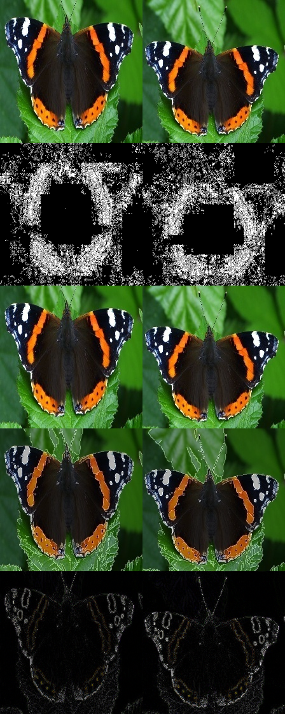

# Assessment Project - `cv-duplicate-detection-mdpi`
---

## 1. Introduction
This repository implements a solution to **detect and analyze near-duplicate images** using a mix of computer vision, deep embeddings and forensic analysis. It applies to a dataset where at least one near-duplicates image occurs.

Table of Contents:
- [1. Dependencies and installation](#1-dependencies-and-installation)
- [2. Project layout](#2-project-layout)
- [3. Quick Start](#3-quick-start)
- [4. Task 1 – Basic Image Processing](#4-task-1--basic-image-processing)
- [5. Task 2 – Duplicate Detection](#5-task-2--duplicate-detection)
  - [5.1 Methods](#51-methods)
  - [5.2 Run a single strategy](#52-run-a-single-strategy)
  - [5.3 Full workflow from raw images](#53-full-workflow-from-raw-images)
  - [5.4 Aggregate from existing CSVs](#54-aggregate-from-existing-csvs)
  - [5.6 ELA‑Based Forensic Investigation](#56-ela-based-forensic-investigation)
- [6 Results and interpretation](#6-results-and-interpretation)
  
---

## 1. Dependencies and installation

The project uses UV for environment and dependency management.
Clone the repository

```
git clone https://github.com/<user>/cv-duplicate-detection-mdpi.git
cd cv-duplicate-detection-mdpi
```

Create the environment and install dependencies

```
uv sync
```

Install the package (expose `mdpi_assessment` CLI)

```
uv run pip install -e .
```

This installs everything from `pyproject.toml` / `uv.lock` and makes the `mdpi_assessment` command-line interface.
To follow up, activate environment with `source .venv/bin/activate` and visualise commands through `mdpi_assessment --help`.

---

## 2. Project layout

- `src/mdpi_assessment/task1/`  
  Basic open-cv image processing (load,  grayscale,  Gaussian blur). 

- `src/mdpi_assessment/task2/strategies/`  
  Duplicate-detection strategies to find similar candidates:
  - `equal.py` – exact file hashing (MD5).
  - `phash.py` – perceptual hashing (pHash).
  - `local_features.py` – ORB keypoints + BF matcher + RANSAC homography.
  - `embedding_nn.py` – MobileNetV2 global embeddings + cosine similarity.
  - `embedding_nn_faiss.py` – Normalized deep embeddings + FAISS inner-product index for fast nearest-neighbour search.

- `src/mdpi_assessment/task2/aggregation/`  
  Voting and aggregation over per-strategy candidate CSVs. 

- `src/mdpi_assessment/task2/verification/`  
  Lightweight error level analysis (ELA-based) verification (single scalar ELA score per pair).

- `src/mdpi_assessment/task2/investigation/`  
  Extended ELA + JPEG + noise forensics and composite visualizations.

- `data/raw/`  
  Input images from the dataset.

- `data/results/`  
  CSV outputs and forensic visualizations.
  
---

## 3. Quick Start

From the project root:

**Task 1: process a random image**

```
mdpi_assessment task1 --random
```

**Task 2: full duplicate-detection workflow from raw images (no investigation)**

```
mdpi_assessment task2_aggregate_from_scratch
--src data/raw
--results-dir data/results
--min-votes 2
--ela-threshold 0.85
```

**Task 2: full workflow with detailed ELA investigation (from scratch)**

```
mdpi_assessment task2_aggregate_from_scratch
--src data/raw
--results-dir data/results
--min-votes 2
--ela-threshold 0.85
--run-investigation
--selection-mode asymmetry
```

After running:

- Check `data/results/task2_forensics_from_scratch.csv` for ELA-verified candidate pairs. 
- Check `data/results/ela_forensics/` and `data/results/task2_ela_forensics.csv` for detailed forensic metrics and visualizations.

---

## 4. Task 1 – Basic Image Processing

**Run Task 1**

```
mdpi_assessment task1 --random
```

**Output files in `data/results/`:**

- `<name>_original.png`
- `<name>_gray.png`
- `<name>_blurred_with_gaussian.png` 

The CLI logs the saved paths for convenience. 

---

## 5. Task 2 – Duplicate Detection

Task 2 detects near-duplicate images using multiple strategies, aggregates their votes, and optionally applies forensic checks. Exactly one true duplicate pair is expected; other pairs are interesting for manual review (human in the loop).

### 5.1 Methods

- **Exact duplicates** – MD5 file hash (`find_equal`). 
- **Perceptual similarity** – pHash on downsampled intensity (`find_phash`).
- **Local geometric consistency** – ORB keypoints, BF matching, RANSAC homography (`find_local_features`). 
- **Global semantics** – MobileNetV2 embeddings (ImageNet) + cosine similarity (`find_embedding_nn`).
- **Forensic verification** – ELA intensity statistics, JPEG quantization tables, and RGB noise residuals.

### 5.2 Run a single strategy

Each command runs one strategy on all images in `data/raw` and writes a CSV to `data/results/`.

Perceptual hash (`pHash`):

```
mdpi_assessment task2_find_similarity
--src data/raw
--out data/results/task2_phash.csv
--strategy find_phash
```

Duplicate check, such as identical images (`equal`):

```
mdpi_assessment task2_find_similarity
--src data/raw
--out data/results/task2_equal.csv
--strategy find_equal
```

Deep embeddings based on MobileNetV2 + cosine similarity (`find_embedding_nn`):

```
mdpi_assessment task2_find_similarity
--src data/raw
--out data/results/task2_embedding_nn.csv
--strategy find_embedding_nn
```

Deep embeddings based on ResNet50 + FAISS and normalized inner-product search (`find_embedding_nn_faiss`):

```
mdpi_assessment task2_find_similarity
--src data/raw
--out data/results/task2_embedding_nn_faiss.csv
--strategy find_embedding_nn_faiss
```


Local features based on ORB + BF + RANSAC (`find_local_features`):

```
mdpi_assessment task2_find_similarity
--src data/raw
--out data/results/task2_local_features.csv
--strategy find_local_features
```

Arguments:

- `--src`: folder with input images.
- `--out`: CSV output path.
- `--strategy`: one of `find_phash`, `find_equal`, `find_embedding_nn`, `find_local_features`. 

Each CSV has:
```
image_a, image_b, score
```

where `score` is strategy-dependent (hash similarity, inlier ratio, cosine similarity, faiss, etc.). 

### 5.3 Full workflow from raw images

Runs all strategies, aggregates candidate pairs, and performs ELA verification in a single command. 

**Without detailed investigation (ELA)**

```
mdpi_assessment task2_aggregate_from_scratch
--src data/raw
--results-dir data/results
--min-votes 2
--ela-threshold 0.85
```

- Step 1: run all configured strategies, writing their per-strategy CSVs into `data/results/`. 
- Step 2: aggregate candidate pairs using a voting rule (`min-votes` = minimum number of strategies that must agree).
- Step 3: run lightweight ELA-based verification and write best obtained candidates `task2_forensics_from_scratch.csv`.

   

**With detailed ELA investigation and selection mode**

```
mdpi_assessment task2_aggregate_from_scratch
--src data/raw
--results-dir data/results
--min-votes 2
--ela-threshold 0.85
--run-investigation
--selection-mode asymmetry
```


- `--run-investigation`: after verification, run full ELA + JPEG + noise analysis for all candidate pairs.
- `--selection-mode`:
  - `balanced`: prefer pairs where both images are similarly suspicious and their composed scores are close. 
  - `asymmetry`: prefer pairs with a strong forensic gap, where one image is clearly more suspicious than the other. 

Investigation produces:

- `data/results/task2_ela_forensics.csv` – detailed forensic metrics and scores per candidate pair. 
- `data/results/ela_forensics/best_pair_*.png` – composite panel for the best pair according to the selected mode.
  

### 5.4 Aggregate from existing CSVs

If the per-strategy CSVs already exist, you can skip rerunning models and only aggregate + verify (and optionally investigate).

**Without investigation**

```
mdpi_assessment task2_aggregate_csvs
--results-dir data/results
--min-votes 2
--ela-threshold 0.85
```

- Reads per-strategy CSVs from `data/results/` (one per strategy).
- Aggregates candidate pairs with the same `min-votes` rule. 
- Runs ELA-based verification and writes `task2_forensics_from_existing_data.csv`.
  

**With detailed investigation and selection mode**

```
mdpi_assessment task2_aggregate_csvs
--results-dir data/results
--image-dir data/raw
--min-votes 2
--ela-threshold 0.85
--run-investigation
--selection-mode asymmetry
```

Where: 

- `--image-dir`: directory with source images (defaults to `data/raw` if omitted).
- `--run-investigation`: run the same detailed ELA pipeline as above on the aggregated candidates. 
- `--selection-mode`: choose between `balanced` and `asymmetry` strategies for picking the "best" forensic pair to visualize.

Outputs:

- `data/results/task2_forensics_from_existing_data.csv` – ELA-verification results from existing candidate CSVs. 
- `data/results/task2_ela_forensics.csv` and `data/results/ela_forensics/` – created if `--run-investigation` is set.
  

### 5.6 ELA‑Based Forensic Investigation

You can also run the detailed investigation **directly**, starting from per-strategy CSVs, without re-running verification. 

**Run ELA Investigation only**

mdpi_assessment task2_investigation
--results-dir data/results
--image-dir data/raw
--min-votes 2
--selection-mode asymmetry

This:

- Reads strategy CSVs from `data/results/`. 
- Re-aggregates candidates using `min-votes`. 
- Computes multiple ELA-derived metrics and a combined forensic score per image. 
- Writes:
  - `data/results/task2_ela_forensics.csv` – metrics and scores per candidate pair. 
  - `data/results/ela_forensics/` – per-image ELA visualizations and a composite figure for the best pair chosen by `selection-mode`.
    
---

## 6 Results and interpretation

The figures below show two example pairs selected after running the presented strategies and ELA investigation.  
Each panel is a vertical stack of views for a **left** image and a **right** image:

- Row 1: original RGB images (left vs right).
- Row 2: ELA maps (bright, noisy regions indicate stronger compression or editing traces).
- Row 3: JPEG-related view (recompressed / quantization artefacts).
- Row 4: RGB noise residuals (image minus a smoothed version).
- Row 5: edge / high-frequency residuals.

### Pair semantics

- **Best pair 1 (asymmetry)**  
  The left image shows stronger ELA responses and noisier residuals than the right one in multiple rows.  
  This is what the **asymmetry** mode is looking for: one frame clearly stands out as more suspicious, closer to a “clean vs manipulated” situation.

- **Best pair 2 (balanced)**  
  Here both images react in a similar way in all forensic views.  
  Their scores are close, so the model treats them as equally suspicious, more like a globally edited pair than a single local tamper.

<table>
  <tr>
    <td align="center">
      <b>Best pair 1 (asymmetry)</b><br><br>
      
    </td>
    <td align="center">
      <b>Best pair 2 (balanced)</b><br><br>
      
    </td>
  </tr>
</table>

The results shown here are only one possible interpretation of the outputs, based on my own reading of the scores and developments. Initially, many images were flagged as suspicious by different methods (including the examples listed above), and the final judgement clearly benefits from a human in the loop who can look at context and visual details. The pipeline itself evolved gradually: at the beginning only a few basic strategies were implemented and tuned via simple thresholds, but over time more tools were added, such as a fast perceptual hash (pHash) or FAISS-based extension of the deep embedding approach (ResNet features with nearest-neighbour search), the last implemented two requiring less computational time. Together, these components form a flexible framework where automated scoring narrows down candidates
  
